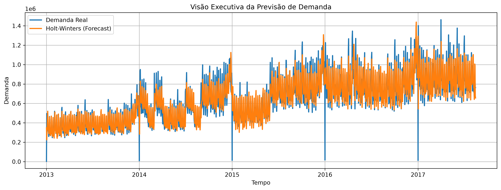

# 📊 Time Series Intelligence & Forecasting System

---

## 🧠 Visão Geral

Sistema completo de análise e previsão de séries temporais aplicado a um cenário de demanda real.

O objetivo é transformar dados históricos em previsões confiáveis, simulando um ambiente real de Data Science aplicado a negócios.

---

## 🎯 Objetivo do Projeto

- Analisar comportamento histórico de demanda
- Criar baseline de previsão
- Implementar modelos estatísticos de forecasting
- Avaliar performance com métricas reais
- Gerar insights para tomada de decisão

---

## 📊 Pipeline do Projeto

### 🔵 1. Entendimento dos Dados
- Leitura com Pandas
- Tratamento de valores nulos
- Análise exploratória (histogramas e boxplots)
- Identificação de padrões temporais

---

### 🟡 2. Engenharia de Série Temporal
- Agregação temporal
- Resample de dados
- Criação de série de demanda
- Média móvel para suavização

---

### 🟠 3. Análise Exploratória
- Visualização da série histórica
- Tendência de crescimento
- Comportamento da demanda ao longo do tempo

---

### 🔴 4. Modelagem de Forecasting

#### 📌 Baseline
- Média móvel (rolling mean)

#### 📌 Modelo Estatístico
- Holt-Winters (Exponential Smoothing)
- Captura de tendência e sazonalidade

---

## 📈 Comparação de Modelos

| Modelo        | MAE        | RMSE       |
|--------------|------------|------------|
| Baseline     | 108.000    | 137.000    |
| Holt-Winters | 55.000     | 94.000     |

---

## 📉 Análise de Resíduos

- Média dos resíduos próxima de zero
- Alta variabilidade natural da série
- Modelo sem viés significativo
- Boa capacidade de generalização

---

## 📊 Visão do Modelo

> *Comparação entre a demanda real e a previsão gerada pelo modelo Holt-Winters, evidenciando a capacidade do modelo de capturar tendência e sazonalidade da série temporal.*

---

## 💡 Insights de Negócio

- A demanda possui tendência clara ao longo do tempo
- Existe sazonalidade relevante
- Modelos simples não capturam o comportamento real
- Holt-Winters melhora significativamente a precisão

---

## 🚀 Conclusão

O modelo Holt-Winters demonstrou desempenho superior ao baseline, reduzindo significativamente os erros de previsão.

Isso confirma que componentes de tendência e sazonalidade são essenciais para previsão de demanda em cenários reais.

---

## 🧠 Próximos Passos

- Modelos ARIMA/SARIMA
- Prophet para sazonalidade avançada
- Pipeline automatizado de forecasting
- Deploy de modelo para simulação de produção

---

## 🛠️ Tecnologias

- Python
- Pandas
- NumPy
- Matplotlib
- Statsmodels
- Jupyter Notebook

---

## 📌 Status do Projeto

✔ EDA concluído  
✔ Engenharia de dados temporal  
✔ Baseline implementado  
✔ Holt-Winters validado  
✔ Avaliação de métricas  
✔ Insights de negócio gerados  

🚧 Em evolução → Prophet e modelos avançados

---

## 🧭 Nota

Este projeto faz parte de um portfólio de Data Science focado em problemas reais de previsão de demanda e simulação de cenários de negócio.